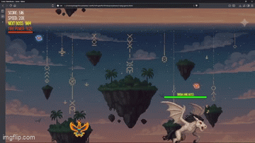
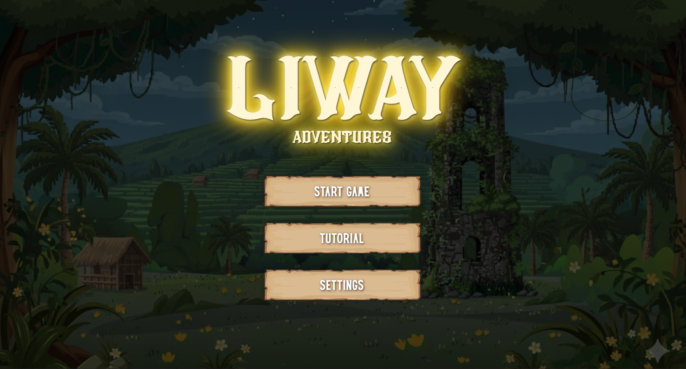
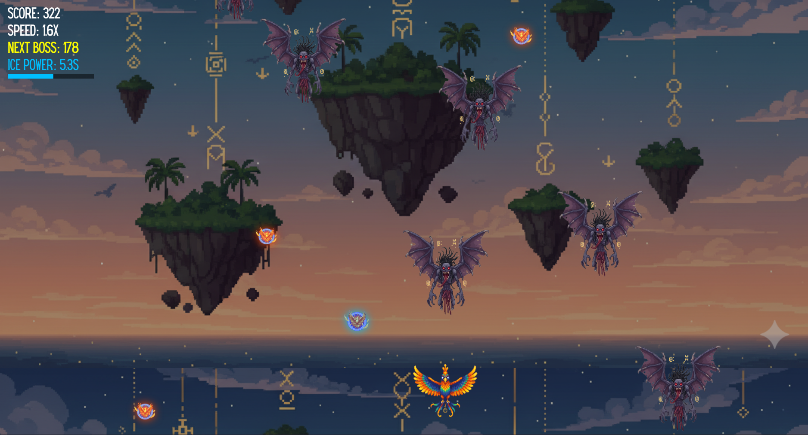
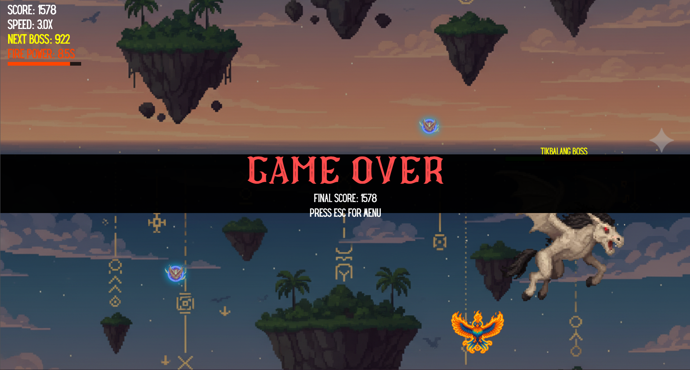

# 🌌 Liway Adventures // Hackathon Project
<div align = "center">
 <p align="center">
  
</p>
</div>
<br> Liway Adventures is a browser-based vertical-scrolling shooter game where players control the <strong>Ibong Adarna</strong>, a mythical bird from Philippine folklore, as it soars through the skies and defeats evil entities.
<br>
<div align = "center">
  <br>▰▰▰▰▰▰▰▰▰▰▰▰ this project was built for a Hackathon by Team XYANA ▰▰▰▰▰▰▰▰▰▰▰▰
</div>

---

## 📑 Table of Contents
1. [Project Description](#project-description)  
2. [Core Mechanics](#core-mechanics)  
3. [About PromptQuest 2025](#about-promptquest-2025)  
4. [Installation Guide](#installation-guide)  
5. [Gameplay](#gameplay)  
6. [Credits](#credits)  

---

## 📝 Project Description <a name="project-description"></a>
Liway Adventures is inspired by **Galactic Pulse** and **Philippine Mythology**.  

The player controls the legendary **Ibong Adarna**, navigating an infinite sky filled with descending enemies.  
The objective is to **survive as long as possible**, collect **power-ups**, and achieve the **highest score**.  

The game was built from scratch using:  
- HTML Canvas for rendering  
- CSS for styling  
- Vanilla JavaScript for game logic  
- No external engines or libraries
- AI tools to ease up the building process

---

## 🎮 Core Mechanics  <a name="core-mechanics"></a>

### Controls
- **← / → Arrow Keys** → Move horizontally  
- **Spacebar** → Shoot fireball attack  

### Gameplay Elements
- 👾 **Enemies** descend from the sky with randomized patterns.  
- 🔥 **Fire Power-up** → Increases fire attack power for a duration.  
- ❄️ **Ice Power-up** → Increases ice attack power for a duration.  

### Rules
- 🏆 **Winning:** Endless play — survive & score as high as possible.  
- 💀 **Losing:** Game ends when the Ibong Adarna collides with an enemy.  

---

## 📢 About PromptQuest 2025  <a name="about-promptquest-2025"></a>

**PromptQuest 2025** is a **university-wide online hackathon** organized by [Proweaver](https://www.proweaver.com/),  
an IT company based in Cebu. Unlike traditional hackathons, it focuses on **AI prompting skills** —  
where students bring ideas to life using creativity and AI tools, even without coding experience.  

📌 Held on **September 9, 2025**  
🎯 Open exclusively to **4th-year students** across different courses  
🏆 Top prize: **₱25,000 cash + certificates + merch**  

---

## ⚙️ Installation Guide <a name="installation-guide"></a>
Clone the repository:  
```bash
git clone https://github.com/your-repo/liway-adventures.git
```
Open the project in your browser:
```bash
open index.html
```
## 🕹️ Gameplay <a name="gameplay"></a>
<div align = "center">

### Controls  
**← / → Arrow Keys** → Move  
**Spacebar** → Shoot  
**Collect Fire/Ice Power-ups** → Boost attacks temporarily  

<br>

### ∘₊✧──────✧₊∘ UI SHOWCASE ∘₊✧──────✧₊∘  

#### Main Menu  
  

#### Gameplay  
  

#### Game Over Screen  
  

</div>

## 📜 Credits  <a name="credits"></a>

<div align="center">

### ∘₊✧──────✧₊∘ DEVELOPMENT ∘₊✧──────✧₊∘  
<p align="center">
  <a href="https://github.com/y4na">
    
  </a>
  <a href="https://github.com/Ariase26">
    
  </a>
  <a href="https://github.com/MKdelosreyes">
    
  </a>
</p>

<p align="center">
  <b>Team XYANA</b> → 
  <a href="https://github.com/y4na">@y4na</a>, 
  <a href="https://github.com/Ariase26">@Ariase26</a>, 
  <a href="https://github.com/MKdelosreyes">@MKdelosreyes</a>
</p>


### ∘₊✧──────✧₊∘ GRAPHICS ∘₊✧──────✧₊∘  
AI-generated sprites (player, enemies, background)  
Free-to-use resource libraries  

### ∘₊✧──────✧₊∘ AUDIO ∘₊✧──────✧₊∘  
**Music** → Royalty-free tracks from YouTube  
**SFX** → Free sound effect websites  

### ∘₊✧──────✧₊∘ AI TOOLS ∘₊✧──────✧₊∘  
ChatGPT  
Gemini  
Claude  

</div>


